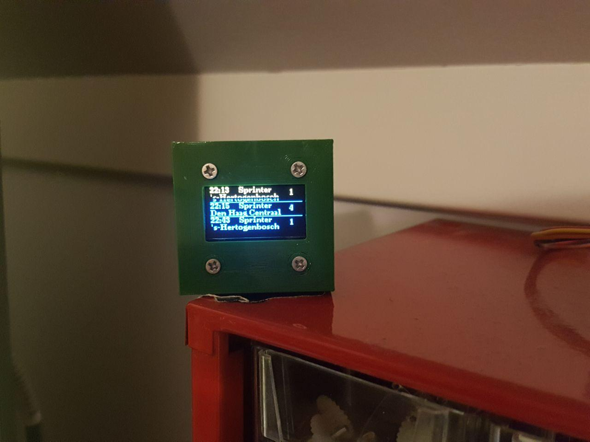

# arduino-9292-library
Arduino library for easily fetching data from the 9292 (Dutch public transport) API to an arduino-compatible microcontroller (ESP32 or ESP8266).
It basically fetches the data and then parses specified variables into strings with which you can do whatever you want. There are two examples for the library. One of them is made to display data onto a 2004 LCD display, and the other example displays onto an OLED-display.

I only knew about the 9292 API URLs because these were reverse-engineered and documented by a couple of people on github already. I used the following specification lists as a reference: https://github.com/oleander/9292-nl-api-spec , https://github.com/aitorvs/9292-api-spec

### Functions in library:

<b>_9292GetData: </b> returns a string fetched from the url given with the function.

<b>_9292GetDepartureInfo: </b> returns a string containing the information you specified in what you gave with it while calling the function. The name is not really suitable as you can actually get some more variables from the function (see reference list below).

<b>getTime: </b> returns a string with the time and date, fetched from "http://worldtimeapi.org/api/timezone/Europe/Amsterdam" when 'dataType' = 0. Only returns time when 'dataType' = 1.

<b>makeURL: </b> returns a URL to put directly into the GetData-function to get journey-information. 
	
	
Whenever you do a request for the departure times, you basically get an array of strings like these:

		{
		  "time": "20:43",
		  "destinationName": "S Hertogenbosch",
		  "viaNames": null,
		  "mode": {
		    "type": "train",
		    "name": "Sprinter"
		  },
		  "operatorName": "NS",
		  "service": null,
		  "platform": "1",
		  "platformChanged": false,
		  "remark": null,
		  "realtimeState": "ontime",
		  "realtimeText": null
		},

Note that not all variables are available in the _9292GetDepartureInfo function (yet)! 
Allthough you can all all functions with their corresponding numbers, the variables with an ! will not always give sensible information!

This function expects the input data in a string, and next the datatype (e.g. time, destinationName etc) in an integer, 
and finally the listPosition (first coming train, or 5 trains ahead?) in an integer . It then returns a string with the data you asked for.
		
### REFERENCE LIST: 

		time = 0
		
		destinationName = 1
		
		!viaNames = 2
		
		type = 3
		
		name = 4
		
		operatorName = 5
		
		!service = 6
		
		platform = 7
		
		!platformChanged = 8
		
		!remark = 9
		
		realtimeState = 10
		
		!realtimeText = 11
		
		
#### The library works with both the ESP32 and the ESP8266, so does the u8g2 example.

The library will be updated and improved soon.
